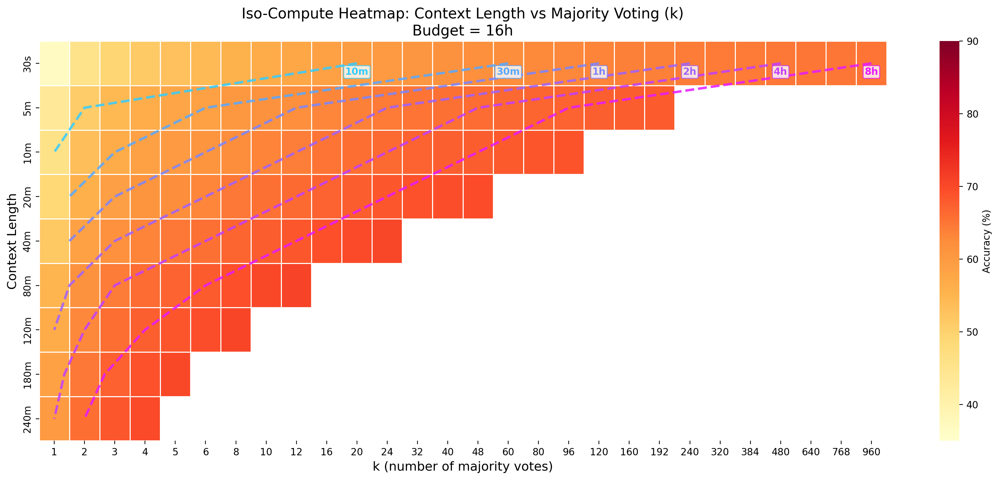
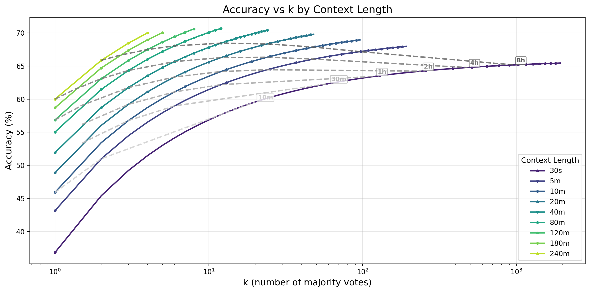
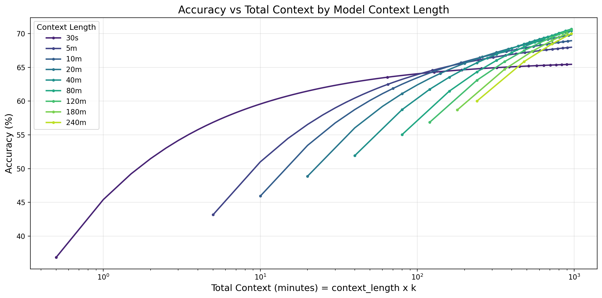
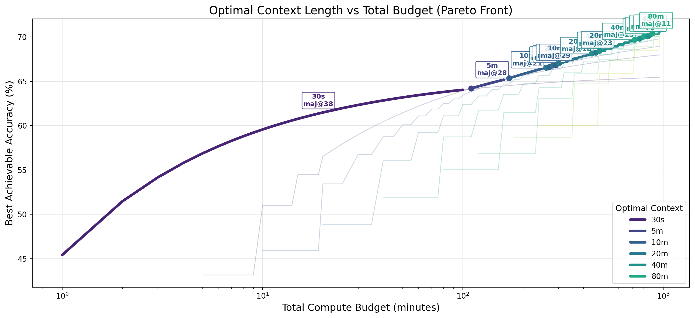
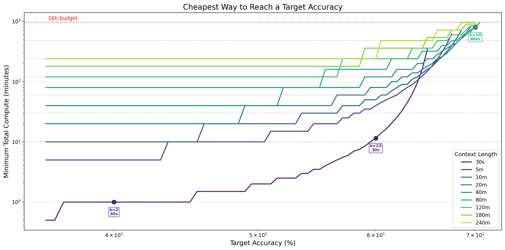
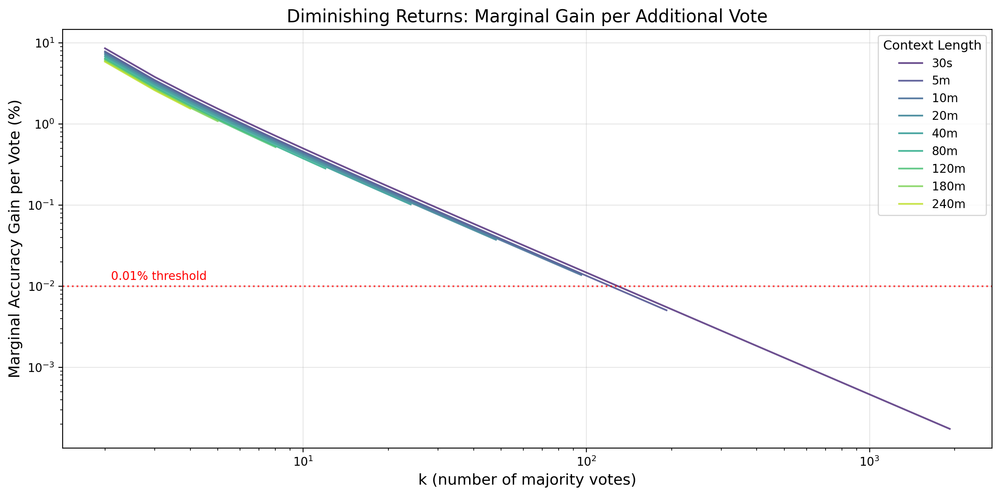
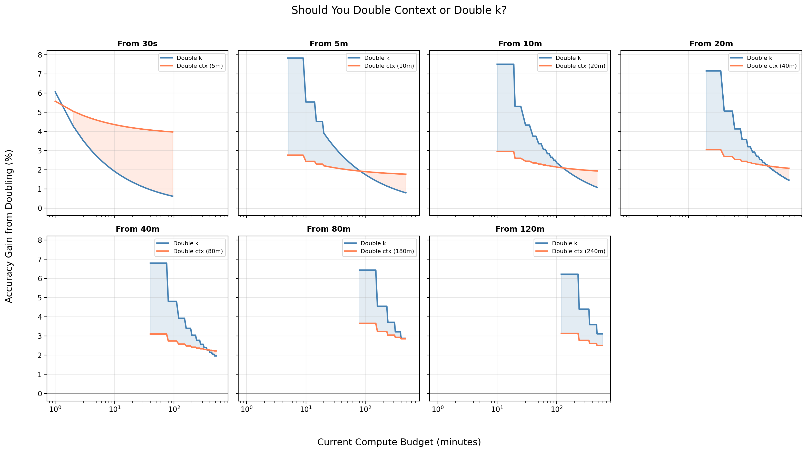

# Iso-Compute Analysis: Context Length vs Majority Voting

This document describes 7 plots analyzing the tradeoff between model context length and majority voting (maj@k) under a fixed compute budget. Each section includes a commentary, the corresponding plot, and a reusable Python function.

## Input Data Hypothesis

All functions expect a pandas DataFrame `df` with the following columns:

| Column | Type | Description |
|--------|------|-------------|
| `context_length_min` | float | Model context length in minutes (e.g. 0.5 for 30s, 10 for 10m) |
| `context_label` | str | Human-readable label (e.g. "30s", "10m", "240m") |
| `k` | int | Number of majority votes |
| `accuracy` | float | Measured accuracy (%) for this (context_length, k) pair |
| `total_compute_min` | float | Total compute = `context_length_min * k` |

Each row represents one experiment: a model with a given context length evaluated with k majority votes. The budget constraint is `total_compute_min <= budget_min`.

---

## 1. Iso-Compute Heatmap



**What it shows:** A heatmap with context length on the y-axis and k on the x-axis. Cell color encodes accuracy. Dashed iso-compute lines connect (context, k) pairs that use the same total compute (e.g. 10m, 30m, 1h, etc.). NaN cells (grey) indicate configurations exceeding the budget.

**How to read it:** Moving right increases k (more votes). Moving down increases context. Iso-compute lines cut diagonally -- along each line, total compute is constant but allocated differently between context and voting. The color gradient along an iso-compute line reveals whether it is better to spend a fixed budget on longer context or more votes.

```python
def plot_iso_compute_heatmap(
    df: "pd.DataFrame",
    budget_min: float,
    iso_computes: list[float] = [10, 30, 60, 120, 240, 480],
    vmin: float = 35,
    vmax: float = 90,
    figsize: tuple = (16, 7),
    save_path: str | None = None,
):
    """
    Plot a heatmap of accuracy over (context_length, k) with iso-compute overlays.

    Parameters
    ----------
    df : DataFrame with columns: context_length_min, context_label, k, accuracy.
    budget_min : Maximum total compute budget in minutes.
    iso_computes : List of total-compute values (minutes) to draw as iso-lines.
    vmin, vmax : Color scale bounds for accuracy.
    """
    import matplotlib.pyplot as plt
    import seaborn as sns
    import numpy as np

    ctx_lengths = df["context_length_min"].unique()
    ctx_labels = df.sort_values("context_length_min").groupby(
        "context_length_min"
    )["context_label"].first().values

    # Subsample k for readability
    target_ks = sorted(set(
        [1, 2, 3, 4, 5, 6, 8, 10, 12, 16, 20, 24, 32, 40, 48, 60, 80, 96,
         120, 160, 192, 240, 320, 384, 480, 640, 768, 960]
    ))
    all_ks_in_data = sorted(df["k"].unique())
    sub_ks = [k for k in target_ks if k in all_ks_in_data]

    # Build matrix
    matrix = np.full((len(ctx_lengths), len(sub_ks)), np.nan)
    ctx_sorted = sorted(ctx_lengths)
    for i, ctx in enumerate(ctx_sorted):
        for j, k in enumerate(sub_ks):
            row = df[(df["context_length_min"] == ctx) & (df["k"] == k)]
            if not row.empty:
                matrix[i, j] = row["accuracy"].values[0]

    fig, ax = plt.subplots(figsize=figsize)
    sns.heatmap(
        matrix, ax=ax, cmap=sns.color_palette("YlOrRd", as_cmap=True),
        xticklabels=[str(k) for k in sub_ks], yticklabels=ctx_labels,
        cbar_kws={"label": "Accuracy (%)"},
        linewidths=0.5, linecolor="white",
        mask=np.isnan(matrix), vmin=vmin, vmax=vmax,
    )
    ax.set_xlabel("k (number of majority votes)")
    ax.set_ylabel("Context Length")
    ax.set_title(f"Iso-Compute Heatmap (Budget = {budget_min / 60:.0f}h)")

    # Iso-compute lines
    iso_colors = plt.cm.cool(np.linspace(0.2, 0.9, len(iso_computes)))
    for ic, cb in enumerate(iso_computes):
        xs, ys = [], []
        for i, ctx in enumerate(ctx_sorted):
            k_needed = cb / ctx
            max_k = budget_min / ctx
            if k_needed < 1 or k_needed > max_k:
                continue
            for jj in range(len(sub_ks) - 1):
                if sub_ks[jj] <= k_needed <= sub_ks[jj + 1]:
                    frac = (k_needed - sub_ks[jj]) / (sub_ks[jj + 1] - sub_ks[jj])
                    xs.append(jj + frac + 0.5)
                    ys.append(i + 0.5)
                    break
        if len(xs) >= 2:
            label = f"{cb}m" if cb < 60 else f"{cb // 60}h"
            ax.plot(xs, ys, color=iso_colors[ic], linewidth=2.5, linestyle="--", alpha=0.85)
            ax.annotate(label, (xs[0], ys[0]), fontsize=10, fontweight="bold",
                        color=iso_colors[ic], ha="center", va="bottom",
                        xytext=(0, -14), textcoords="offset points",
                        bbox=dict(boxstyle="round,pad=0.15", fc="white",
                                  ec=iso_colors[ic], alpha=0.8))

    plt.tight_layout()
    if save_path:
        plt.savefig(save_path, dpi=200, bbox_inches="tight")
    return fig, ax
```

---

## 2. Accuracy vs k



**What it shows:** For each model (context length), accuracy as a function of k on a log-scaled x-axis. Dashed grey iso-compute lines connect points across models that use the same total compute.

**How to read it:** Each colored curve shows how a single model improves with more majority votes. Curves start at k=1 (single pass) and extend until the budget is exhausted. The iso-compute lines cut across curves: points on the same iso-line use equal total compute but distribute it differently. Where an iso-line intersects a higher curve, that configuration is more compute-efficient.

```python
def plot_accuracy_vs_k(
    df: "pd.DataFrame",
    budget_min: float,
    iso_computes: list[float] = [10, 30, 60, 120, 240, 480],
    figsize: tuple = (12, 6),
    save_path: str | None = None,
):
    """
    Plot accuracy vs k for each context length, with iso-compute lines.

    Parameters
    ----------
    df : DataFrame with columns: context_length_min, context_label, k, accuracy.
    budget_min : Maximum total compute budget in minutes.
    iso_computes : Total-compute values (minutes) for iso-lines.
    """
    import matplotlib.pyplot as plt
    import seaborn as sns
    import numpy as np

    ctx_lengths = sorted(df["context_length_min"].unique())
    palette = sns.color_palette("viridis", len(ctx_lengths))

    fig, ax = plt.subplots(figsize=figsize)
    for i, ctx in enumerate(ctx_lengths):
        sub = df[df["context_length_min"] == ctx].sort_values("k")
        label = sub["context_label"].iloc[0]
        ax.plot(sub["k"], sub["accuracy"], color=palette[i], linewidth=2,
                label=label, marker="o", markersize=3,
                markevery=max(1, len(sub) // 15))

    # Iso-compute lines
    iso_colors = plt.cm.Greys(np.linspace(0.3, 0.7, len(iso_computes)))
    for ic, cb in enumerate(iso_computes):
        ks_iso, perfs_iso = [], []
        for ctx in ctx_lengths:
            k_at = cb / ctx
            if k_at < 1 or k_at > budget_min / ctx:
                continue
            row = df[(df["context_length_min"] == ctx) &
                     (df["k"] == int(round(k_at)))]
            if not row.empty:
                ks_iso.append(k_at)
                perfs_iso.append(row["accuracy"].values[0])
        if len(ks_iso) >= 2:
            order = np.argsort(ks_iso)
            ks_iso = [ks_iso[o] for o in order]
            perfs_iso = [perfs_iso[o] for o in order]
            label = f"{cb}m" if cb < 60 else f"{cb // 60}h"
            ax.plot(ks_iso, perfs_iso, color=iso_colors[ic], linewidth=2,
                    linestyle="--", alpha=0.8)
            ax.annotate(label, (ks_iso[-1], perfs_iso[-1]), fontsize=9,
                        fontweight="bold", color=iso_colors[ic],
                        ha="left", va="bottom", xytext=(4, 2),
                        textcoords="offset points",
                        bbox=dict(boxstyle="round,pad=0.15", fc="white",
                                  ec=iso_colors[ic], alpha=0.8))

    ax.set_xscale("log")
    ax.set_xlabel("k (number of majority votes)")
    ax.set_ylabel("Accuracy (%)")
    ax.set_title("Accuracy vs k by Context Length")
    ax.legend(title="Context Length")
    ax.grid(True, alpha=0.3)
    plt.tight_layout()
    if save_path:
        plt.savefig(save_path, dpi=200, bbox_inches="tight")
    return fig, ax
```

---

## 3. Accuracy vs Total Context



**What it shows:** Accuracy as a function of total context consumed (context_length x k), colored by model context length.

**How to read it:** This plot normalizes the x-axis to total compute, making it easy to compare models at equal compute. If a shorter-context model's curve sits above a longer-context model's curve at the same x-value, the shorter model is more efficient at that compute level (it achieves higher accuracy with the same total context via more votes). Crossover points reveal where it becomes worthwhile to switch to a longer context model.

```python
def plot_accuracy_vs_total_context(
    df: "pd.DataFrame",
    figsize: tuple = (12, 6),
    save_path: str | None = None,
):
    """
    Plot accuracy vs total context (context_length * k) for each model.

    Parameters
    ----------
    df : DataFrame with columns: context_length_min, context_label, k,
         accuracy, total_compute_min.
    """
    import matplotlib.pyplot as plt
    import seaborn as sns

    ctx_lengths = sorted(df["context_length_min"].unique())
    palette = sns.color_palette("viridis", len(ctx_lengths))

    fig, ax = plt.subplots(figsize=figsize)
    for i, ctx in enumerate(ctx_lengths):
        sub = df[df["context_length_min"] == ctx].sort_values("k")
        label = sub["context_label"].iloc[0]
        ax.plot(sub["total_compute_min"], sub["accuracy"],
                color=palette[i], linewidth=2, label=label, marker="o",
                markersize=3, markevery=max(1, len(sub) // 15))

    ax.set_xscale("log")
    ax.set_xlabel("Total Context (minutes) = context_length x k")
    ax.set_ylabel("Accuracy (%)")
    ax.set_title("Accuracy vs Total Context by Model Context Length")
    ax.legend(title="Context Length")
    ax.grid(True, alpha=0.3)
    plt.tight_layout()
    if save_path:
        plt.savefig(save_path, dpi=200, bbox_inches="tight")
    return fig, ax
```

---

## 4. Optimal Tradeoff (Pareto Front)



**What it shows:** The Pareto-optimal frontier: for each total compute budget, which (context_length, k) pair achieves the highest accuracy. The bold line is colored by the winning context length, with annotations showing `maj@k`. Faded lines in the background show each individual model's curve for reference.

**How to read it:** Follow the bold line left to right. Color changes indicate regime shifts where a different context length becomes optimal. At low budgets, short-context models with many votes dominate. As the budget grows, longer-context models take over because their higher base accuracy outweighs the voting benefit. The `maj@k` annotations tell you the exact voting configuration at each regime's midpoint.

```python
def plot_optimal_tradeoff(
    df: "pd.DataFrame",
    budget_min: float,
    figsize: tuple = (13, 6),
    save_path: str | None = None,
):
    """
    Plot the Pareto front: best accuracy at each budget, colored by optimal ctx.

    Parameters
    ----------
    df : DataFrame with columns: context_length_min, context_label, k,
         accuracy, total_compute_min.
    budget_min : Maximum total compute budget in minutes.
    """
    import matplotlib.pyplot as plt
    import seaborn as sns
    import numpy as np

    ctx_lengths = sorted(df["context_length_min"].unique())
    ctx_labels = {ctx: df[df["context_length_min"] == ctx]["context_label"].iloc[0]
                  for ctx in ctx_lengths}
    palette = sns.color_palette("viridis", len(ctx_lengths))
    ctx_to_color = {ctx: palette[i] for i, ctx in enumerate(ctx_lengths)}

    budgets_sweep = np.unique(np.concatenate([
        np.arange(1, 20, 1), np.arange(20, 100, 5),
        np.arange(100, budget_min + 1, 10),
    ]))

    opt_budgets, opt_perfs, opt_ctxs, opt_ks = [], [], [], []
    for b in budgets_sweep:
        best_p, best_ctx, best_k = -1, None, None
        for ctx in ctx_lengths:
            sub = df[(df["context_length_min"] == ctx) &
                     (df["total_compute_min"] <= b)]
            if sub.empty:
                continue
            best_row = sub.loc[sub["accuracy"].idxmax()]
            if best_row["accuracy"] > best_p:
                best_p = best_row["accuracy"]
                best_ctx = ctx
                best_k = int(best_row["k"])
        if best_ctx is not None:
            opt_budgets.append(b)
            opt_perfs.append(best_p)
            opt_ctxs.append(best_ctx)
            opt_ks.append(best_k)

    fig, ax = plt.subplots(figsize=figsize)

    # Background lines
    for i, ctx in enumerate(ctx_lengths):
        sub = df[df["context_length_min"] == ctx].sort_values("total_compute_min")
        ax.plot(sub["total_compute_min"], sub["accuracy"],
                color=palette[i], linewidth=1, alpha=0.25)

    # Segments
    segments, seg_start = [], 0
    for j in range(1, len(opt_budgets)):
        if opt_ctxs[j] != opt_ctxs[j - 1]:
            segments.append((seg_start, j))
            seg_start = j
    segments.append((seg_start, len(opt_budgets)))

    labeled = set()
    for s, e in segments:
        ctx = opt_ctxs[s]
        lbl = ctx_labels[ctx] if ctx not in labeled else None
        ax.plot(opt_budgets[s:e], opt_perfs[s:e], color=ctx_to_color[ctx],
                linewidth=3.5, solid_capstyle="round", label=lbl)
        labeled.add(ctx)
        mid = (s + e) // 2
        ax.annotate(f"{ctx_labels[ctx]}\nmaj@{opt_ks[mid]}",
                    (opt_budgets[mid], opt_perfs[mid]),
                    fontsize=9, fontweight="bold", color=ctx_to_color[ctx],
                    ha="center", va="bottom", xytext=(0, 8),
                    textcoords="offset points",
                    bbox=dict(boxstyle="round,pad=0.2", fc="white",
                              ec=ctx_to_color[ctx], alpha=0.85))

    ax.set_xscale("log")
    ax.set_xlabel("Total Compute Budget (minutes)")
    ax.set_ylabel("Best Achievable Accuracy (%)")
    ax.set_title("Optimal Context Length vs Total Budget (Pareto Front)")
    ax.legend(title="Optimal Context", loc="lower right")
    ax.grid(True, alpha=0.3)
    plt.tight_layout()
    if save_path:
        plt.savefig(save_path, dpi=200, bbox_inches="tight")
    return fig, ax
```

---

## 5. Min-Cost Frontier



**What it shows:** For each target accuracy (x-axis, log scale), the minimum total compute needed to reach it (y-axis, log scale), one curve per context length. Annotated dots at key accuracy thresholds (40%, 60%, 70%, 80%, 90%, 95%, 99%, 99.99%) show the cheapest option with its `k` value and context length. Horizontal dashed lines mark iso-compute budgets.

**How to read it:** Pick your desired accuracy on the x-axis, then read the cheapest option from the lowest curve at that point. The annotated dots highlight the globally cheapest configuration at key thresholds. Curves that flatten early (go vertical) indicate models that cannot reach higher accuracies even with unlimited k. The red budget line shows the hard ceiling.

```python
def plot_min_cost_frontier(
    df: "pd.DataFrame",
    budget_min: float,
    annot_targets: list[float] = [40, 60, 70, 80, 90, 95, 99, 99.99],
    iso_computes: list[float] = [10, 30, 60, 120, 240, 480],
    figsize: tuple = (14, 7),
    save_path: str | None = None,
):
    """
    Plot min compute cost to reach each target accuracy, per context length.

    Parameters
    ----------
    df : DataFrame with columns: context_length_min, context_label, k,
         accuracy, total_compute_min.
    budget_min : Maximum total compute budget in minutes.
    annot_targets : Accuracy thresholds (%) to annotate with best (ctx, k).
    iso_computes : Horizontal iso-compute reference lines (minutes).
    """
    import matplotlib.pyplot as plt
    import seaborn as sns
    import numpy as np

    ctx_lengths = sorted(df["context_length_min"].unique())
    palette = sns.color_palette("viridis", len(ctx_lengths))

    fig, ax = plt.subplots(figsize=figsize)
    target_accs = np.arange(36, 100, 0.5)

    for i, ctx in enumerate(ctx_lengths):
        sub = df[df["context_length_min"] == ctx].sort_values("k")
        label = sub["context_label"].iloc[0]
        costs, targets = [], []
        for t in target_accs:
            hits = sub[sub["accuracy"] >= t]
            if not hits.empty:
                costs.append(hits["total_compute_min"].min())
                targets.append(t)
        if targets:
            ax.plot(targets, costs, color=palette[i], linewidth=2, label=label)

    # Annotate cheapest option at key thresholds
    for target in annot_targets:
        best_cost, best_k, best_i = float("inf"), None, None
        for i, ctx in enumerate(ctx_lengths):
            sub = df[(df["context_length_min"] == ctx) & (df["accuracy"] >= target)]
            if not sub.empty:
                row = sub.loc[sub["total_compute_min"].idxmin()]
                if row["total_compute_min"] < best_cost:
                    best_cost = row["total_compute_min"]
                    best_k = int(row["k"])
                    best_i = i
        if best_i is not None and best_cost <= budget_min:
            lbl = df[df["context_length_min"] == ctx_lengths[best_i]]["context_label"].iloc[0]
            ax.plot(target, best_cost, "o", color=palette[best_i], markersize=8,
                    zorder=5, markeredgecolor="black", markeredgewidth=0.8)
            ax.annotate(f"k={best_k}\n{lbl}", (target, best_cost),
                        fontsize=8, fontweight="bold", color=palette[best_i],
                        ha="center", va="top", xytext=(0, -12),
                        textcoords="offset points",
                        bbox=dict(boxstyle="round,pad=0.2", fc="white",
                                  ec=palette[best_i], alpha=0.85))

    ax.set_xscale("log")
    ax.set_yscale("log")
    ax.set_xlabel("Target Accuracy (%)")
    ax.set_ylabel("Minimum Total Compute (minutes)")
    ax.set_title("Cheapest Way to Reach a Target Accuracy")
    ax.legend(title="Context Length")
    ax.grid(True, alpha=0.3)
    ax.axhline(y=budget_min, color="red", linestyle=":", linewidth=1.5, alpha=0.7)
    for cb in iso_computes:
        label = f"{cb}m" if cb < 60 else f"{cb // 60}h"
        ax.axhline(y=cb, color="grey", linestyle="--", linewidth=0.8, alpha=0.5)
        ax.annotate(label, (target_accs[-1], cb), fontsize=8, color="grey",
                    ha="right", va="bottom")
    plt.tight_layout()
    if save_path:
        plt.savefig(save_path, dpi=200, bbox_inches="tight")
    return fig, ax
```

---

## 6. Marginal Gain per Additional Vote



**What it shows:** The marginal accuracy improvement gained by adding one more vote, plotted against k (both axes log scale), one curve per context length. A red reference line marks the 0.01% threshold.

**How to read it:** All curves slope downward -- each additional vote helps less than the previous one. Shorter-context models (top curves) benefit more from voting because their individual predictions are noisier. The 0.01% threshold line indicates where further voting is practically negligible. The k value where each curve crosses this threshold is the "effective max k" for that model.

```python
def plot_marginal_gain(
    df: "pd.DataFrame",
    threshold: float = 0.01,
    figsize: tuple = (12, 6),
    save_path: str | None = None,
):
    """
    Plot marginal accuracy gain per additional vote for each context length.

    Parameters
    ----------
    df : DataFrame with columns: context_length_min, context_label, k, accuracy.
    threshold : Reference line for "negligible" gain (%).
    """
    import matplotlib.pyplot as plt
    import seaborn as sns
    import numpy as np

    ctx_lengths = sorted(df["context_length_min"].unique())
    palette = sns.color_palette("viridis", len(ctx_lengths))

    fig, ax = plt.subplots(figsize=figsize)
    for i, ctx in enumerate(ctx_lengths):
        sub = df[df["context_length_min"] == ctx].sort_values("k")
        if len(sub) < 2:
            continue
        label = sub["context_label"].iloc[0]
        ks = sub["k"].values
        accs = sub["accuracy"].values
        marginal = np.diff(accs)
        ax.plot(ks[1:], marginal, color=palette[i], linewidth=1.5,
                label=label, alpha=0.8)

    ax.set_xscale("log")
    ax.set_yscale("log")
    ax.set_xlabel("k (number of majority votes)")
    ax.set_ylabel("Marginal Accuracy Gain per Vote (%)")
    ax.set_title("Diminishing Returns: Marginal Gain per Additional Vote")
    ax.legend(title="Context Length")
    ax.grid(True, alpha=0.3)
    ax.axhline(y=threshold, color="red", linestyle=":", linewidth=1.5, alpha=0.7)
    ax.annotate(f"{threshold}% threshold", (2, threshold), fontsize=10,
                color="red", va="bottom", xytext=(5, 3),
                textcoords="offset points")
    plt.tight_layout()
    if save_path:
        plt.savefig(save_path, dpi=200, bbox_inches="tight")
    return fig, ax
```

---

## 7. Double Context vs Double k



**What it shows:** A grid of subplots, one per starting context length. In each subplot, two curves compare the accuracy gain from doubling the compute budget in two ways: (1) keep the same context, double k (blue, "Double k"), or (2) switch to a model with ~2x context, keep k the same (coral, "Double ctx"). Shaded regions highlight which strategy wins.

**How to read it:** When the blue region dominates (low budgets), it is more effective to run more votes with the current model. When coral dominates (higher budgets), switching to a longer-context model gives more return. The crossover point is the budget at which you should "upgrade" to a longer context model rather than running more votes. This directly informs the decision: "I have X more compute -- should I retrain with longer context or just vote more?"

```python
def plot_double_tradeoff(
    df: "pd.DataFrame",
    budget_min: float,
    figsize: tuple = (16, 9),
    save_path: str | None = None,
):
    """
    Compare accuracy gain from doubling k vs doubling context length.

    Parameters
    ----------
    df : DataFrame with columns: context_length_min, context_label, k,
         accuracy, total_compute_min.
    budget_min : Maximum total compute budget in minutes.
    """
    import matplotlib.pyplot as plt
    import seaborn as sns
    import numpy as np

    ctx_lengths = sorted(df["context_length_min"].unique())
    ctx_labels = {ctx: df[df["context_length_min"] == ctx]["context_label"].iloc[0]
                  for ctx in ctx_lengths}

    # Pair each ctx with the next ctx >= 2x (with 0.8 tolerance)
    ctx_pairs = []
    for i, ctx in enumerate(ctx_lengths[:-1]):
        doubled = [c for c in ctx_lengths if c >= 2 * ctx * 0.8]
        if doubled:
            ctx_pairs.append((ctx, doubled[0]))

    n = len(ctx_pairs)
    fig, axes = plt.subplots(2, (n + 1) // 2, figsize=figsize, sharex=True, sharey=True)
    axes = axes.flatten()

    budgets_sweep = np.unique(np.concatenate([
        np.arange(1, 20, 1), np.arange(20, 100, 5),
        np.arange(100, budget_min + 1, 10),
    ]))

    for idx, (ctx, ctx2) in enumerate(ctx_pairs):
        ax = axes[idx]
        bs, g_k_list, g_c_list = [], [], []

        sub1 = df[df["context_length_min"] == ctx].set_index("k")["accuracy"]
        sub2 = df[df["context_length_min"] == ctx2].set_index("k")["accuracy"]

        for b in budgets_sweep:
            k = int(b // ctx)
            if k < 1 or k not in sub1.index:
                continue
            k2 = 2 * k
            if k2 not in sub1.index or ctx * k2 > budget_min:
                continue
            if k not in sub2.index or ctx2 * k > budget_min:
                continue
            bs.append(b)
            g_k_list.append(sub1[k2] - sub1[k])
            g_c_list.append(sub2[k] - sub1[k])

        if bs:
            ax.plot(bs, g_k_list, color="steelblue", linewidth=2, label="Double k")
            ax.plot(bs, g_c_list, color="coral", linewidth=2,
                    label=f"Double ctx ({ctx_labels[ctx2]})")
            ax.axhline(y=0, color="grey", linewidth=0.5)
            ax.fill_between(bs, g_k_list, g_c_list,
                            where=[gk > gc for gk, gc in zip(g_k_list, g_c_list)],
                            alpha=0.15, color="steelblue")
            ax.fill_between(bs, g_k_list, g_c_list,
                            where=[gc > gk for gk, gc in zip(g_k_list, g_c_list)],
                            alpha=0.15, color="coral")
            ax.set_xscale("log")
            ax.set_title(f"From {ctx_labels[ctx]}", fontweight="bold")
            ax.legend(fontsize=8)
            ax.grid(True, alpha=0.3)

    for idx in range(len(ctx_pairs), len(axes)):
        axes[idx].set_visible(False)

    fig.supxlabel("Current Compute Budget (minutes)", y=0.02)
    fig.supylabel("Accuracy Gain from Doubling (%)", x=0.02)
    fig.suptitle("Should You Double Context or Double k?", y=0.98)
    plt.tight_layout(rect=[0.03, 0.04, 1, 0.96])
    if save_path:
        plt.savefig(save_path, dpi=200, bbox_inches="tight")
    return fig, axes
```
